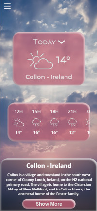
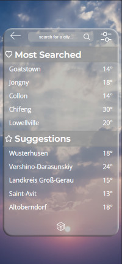

# Weather App

## About the Project
A basic weather app by city, incorporating wikipedia excerpts for the city, with random sugestions.

The original project aimed to suggest cities by picking the weather but it required more complicated work that the timeframe allowed so it has been scrapped for now.

### Features
- Random city on page load
- Current weather
- Forecast every 3 hours 
- Wikipedia excerpt if availlable
- Menu to check 4 days forward
- Searchbar to look a city up
- Keeps track of and displays the 5 most searched cities
- 5 random suggested cities that can be randomized again

### Built With
 

 

## Team
#### Design

#### Integration

## Getting Started
### Prerequisites
A working php environment.

Personally using Laragon =>

### Installation
In Laragon, download and unzip or clone the repo in the www folder in the Laragon directory.

With pretty url enabled, the app is available locally through your browser at weather-app-main.test or whatever-the-name-of-the-folder-in-www-is.test.
## License

 

You are free to:

    Share — copy and redistribute the material in any medium or format
    Adapt — remix, transform, and build upon the material 

Under the following terms:

    Attribution — You must give appropriate credit, provide a link to the license, and indicate if changes were made. You may do so in any reasonable manner, but not in any way that suggests the licensor endorses you or your use.

    NonCommercial — You may not use the material for commercial purposes.

    ShareAlike — If you remix, transform, or build upon the material, you must distribute your contributions under the same license as the original. 

[Legal Mentions](https://creativecommons.org/licenses/by-nc-sa/4.0/legalcode)